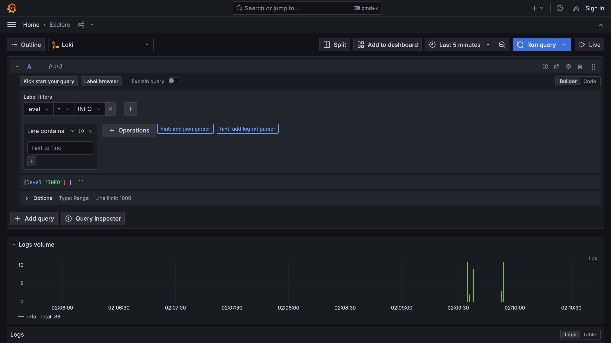
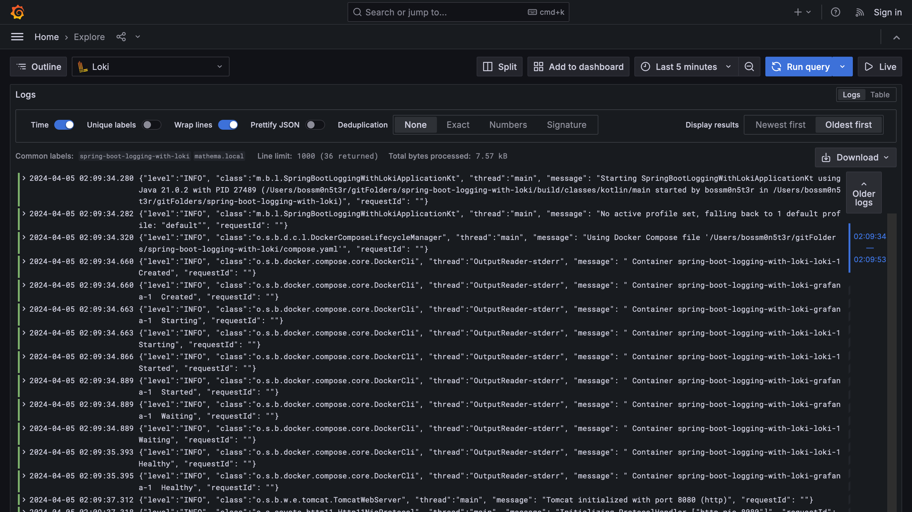
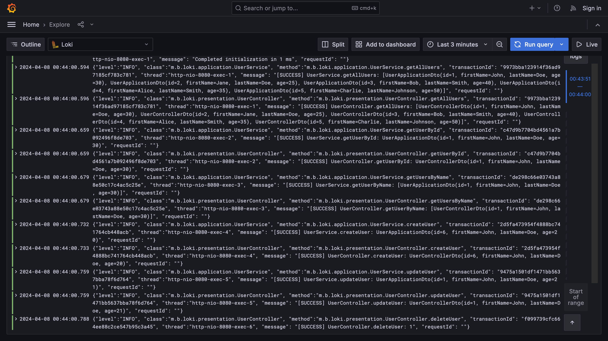

# spring-boot-logging-with-loki





## Configure OncePerRequestFilterImpl and Use MDC value in logback-spring.xml

```kotlin
@Component
class OncePerRequestFilterImpl : OncePerRequestFilter() {
    override fun doFilterInternal(request: HttpServletRequest, response: HttpServletResponse, filterChain: FilterChain) {
        MDC.put(MDCKey.TRANSACTION_ID.value, generateTransactionId())
        filterChain.doFilter(request, response)
        MDC.clear()
    }
}
```

```xml

<message>
    <pattern>
        {"level":"%level", "class":"%logger{36}", "method":"%class{36}.%M", "transactionId": "%X{transactionId}", "thread":"%thread", "message":
        "%message", "requestId": "%X{X-Request-ID}"}
    </pattern>
</message>
```



## References

- https://www.baeldung.com/spring-boot-loki-grafana-logging
- https://piotrminkowski.com/2023/07/05/logging-in-spring-boot-with-loki/
  - https://github.com/piomin/sample-spring-boot-web

### Logback

- https://stackoverflow.com/questions/15258144/how-do-i-configure-logback-to-print-out-the-class-name
