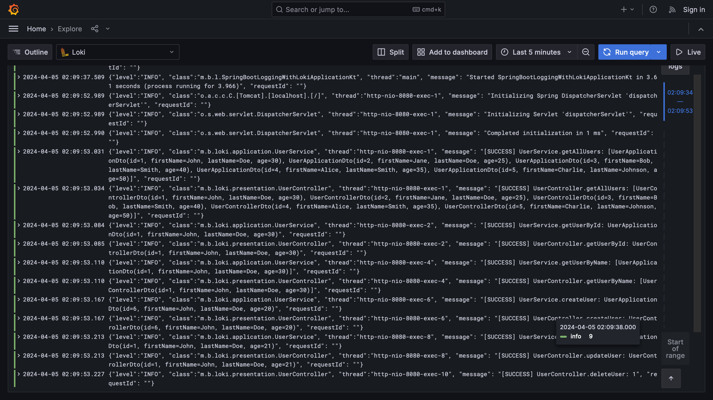

# spring-boot-logging-with-loki

## References

- https://www.baeldung.com/spring-boot-loki-grafana-logging
- https://piotrminkowski.com/2023/07/05/logging-in-spring-boot-with-loki/
  - https://github.com/piomin/sample-spring-boot-web
